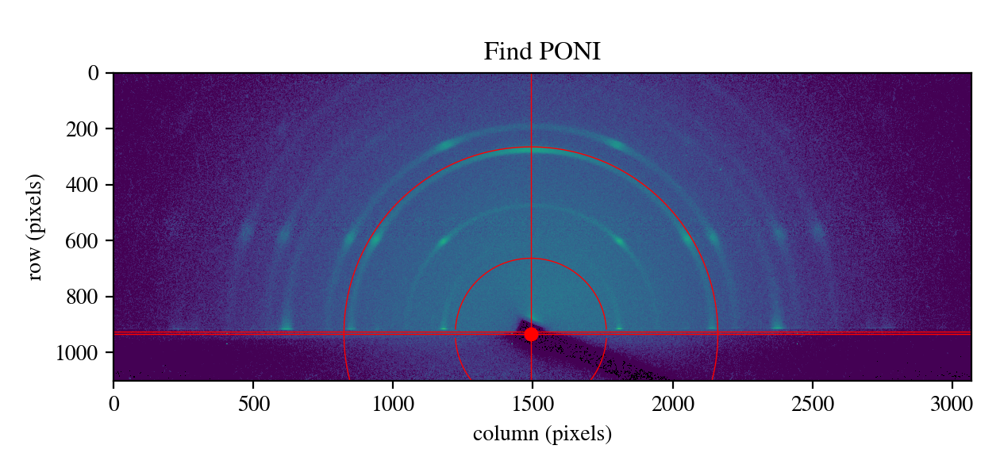
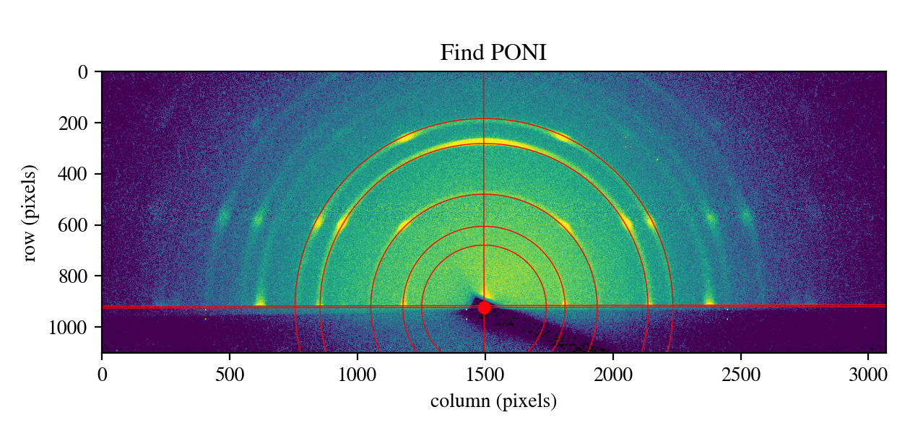
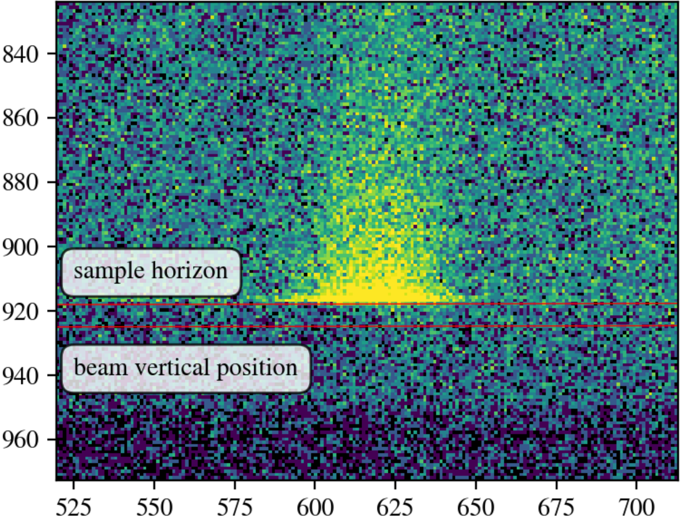

# Installation

GixPy is distributed on PyPI and can be installed using pip:

```
pip install gixpy
```

It can be built from source by cloning https://github.com/ttortorici/gixpy.git and using Python's `build` tool (don't forget to `cd` into the repository):

```
pip install -U setuptools build
python -m build
pip install dist/*.whl
```

where `*` should be replaced with the actual wheel's filename, and `\` should be used instead of `/` on Windows.

# Examples

### transform-GIWAXS.ipynb

This jupyter notebook can be used as a complete workflow to process an image. The sample-detector distance, critical angle, and tilt angle must be known through other experimental means.

#### Cell 1

Import packages, load data, and show data. If no flat field is needed, the lines of code loading the flat-field file, and plotting it should be removed.

#### Cell 2

Apply the flat-field correction to the image and save it. If no flat-field correction is needed, this cell can be removed and the figure in the previous cell can be saved instead.

#### Cell 3

If the beam center (PONI) is not known, this cell is the start of a process for locating it. The `gixpy.poni.Nudger` class creates a `beam_finder` object that plots rings and horizontal lines at the beam center and the sample horizon (a projection from the film plane to the projector).

The PONI and the tilt can be adjusted so that the horizon meets the bottom of the in-plane-scattering ring segments.



An example plot generated by the cell.

#### Cell 4

This cell allows you to adjust the tilt, and beam center until the features on the plot look right.



The `beam_finder.radii` is a list of values corresponding to the red circles seen above. The values will roughly correspond to lattice spacings in the crystal, so if you know what these roughly are, you can get the circles to roughly the right size easily (note: larger layer spacings correspond to smaller radii on the detector).

`beam_finder.show()` is used to set the maximum value in the color range. For example, if `beam_finder.show(data.max())` is used, the full dynamic range will be used.

`beam_finder.set_tilt()` changes the tilt angle, and `beam_finder.set_nudge()` moves the beam center relative to what was initially set (in units of pixel widths).


The horizontal nudge can be adjusted until the ring segments are symmetrically intersected by red circles.



Using `%matplotlib widget`, the user can zoom in on ring segments along the horizontal direction (in-plane scattering). The vertical nudge, and the tilt can be adjusted so that the horizon meets the bottom of the ring segment. The tilted sample will occlude any scattering that does not scatter with in a positive vertical direction, so projecting the sample horizon to the detector (the higher of the two horizontal red lines) allows the user to line this up with the occlusion to determine both the vertical nudge and the tilt by looking at two symmetric features.

#### Cell 5

After finalizing the tilt and nudge, this cell will update the PONI file (named cal.poni in this example) that holds the experimental geometry.

Example PONI file

```
# Nota: C-Order, 1 refers to the Y axis, 2 to the X axis
# Calibration done on Fri Nov 15 20:38:56 2024
poni_version: 2.1
Detector: Detector
Detector_config: {"pixel1": 7.5e-05, "pixel2": 7.5e-05, "max_shape": [1102, 3070], "orientation": 2}
Distance: 0.1569
Poni1: 0.01345
Poni2: 0.11233821035361662
Rot1: 0
Rot2: 0
Rot3: 0
Wavelength: 1.54185e-10
```

#### Cell 6

Transform the image using the experimental geometry laid out int the PONI file and plot it.

#### Cell 7

This cell is used to prepare the pyFAI-calib2 GUI program for making a custom mask. Generate a string command to give to the terminal to lauch pyFAI-calib2 with the image and detector configuration loaded. This speeds up the workflow since you will not need to manually load in this information using the GUI.

On Windows, this will automatically copy the string to the clipboard. Otherwise, it will print the string to the output and it can manually be copied.

With your Python virtual environment (with pyFAI installed) activated, paste the pyFAI-calib2 command to launch the GUI. The mask tab can be used to draw a mask over, for example, a beam stop, and then saved as mask.edf.

#### Cell 8

Plot and save the image with the relative weights adjusted due to the pixel movement.

#### Cell 9

Load the mask file you created. If you did not make a mask, call `transformer.load_mask()` with no inputs. This will use the transformed flat field to mask out pixels which no counts were moved to from the transformation. With a custom mask, the two masks will be layered.

#### Cell 10

Use pyFAI to create a "cake" image (counts vs azimuthal angle vs reciprocal space) using `AzimuthalIntegrator.integrate2d_ng()`. This can be used to inspect the transformation. Partial rings should be represented as partial columns in this plot.

#### Cell 11

Creates a function to overwrite data files from the upcoming integrations, so that you can rerun them and update the data.

#### Cell 12

Integrate a sector from $0\degree$ to $180\degree$. The `exposure_time` input allows you to represent the data as intensity by dividing by the exposure time (in any units you prefer).

This cell can be duplicated and `azimuthal_range` and `sector_name` can be changed to produce different sectors.


# Command line tool: gixpy-transform

Installing GixPy allows you to call the program `gixpy-transform` from the terminal, command prompt, PowerShell, Anaconda Prompt, or Anaconda PowerShell.

## Usage

```sh
gixpy-transform [-h] [-P] [-F FLATFIELD] [-C CRITICAL_ANGLE] [-I INCIDENT_ANGLE] [-T TILT_ANGLE] [-TIF] filename poni
```

## Positional arguments

### File name

The first argument is the path to the file containing image data (usually a .tif or .edf file). This should be wrapped in quotations marks if the path to the file has spaces in it: e.g. `"example directory\file.tif"`. A relative path from the current working directory can be used, or simply the file name can be used if the file is in the current working directory.

### PONI

There are two options:

1. You can pass a path to a pyFAI PONI file: e.g. `"path\to\file\geometry.poni"`

2. You can pass the relevant data as comma-separated values in the following order:

    - poni1: distance (in meters) of the PONI from bottom edge of the detector. If the -P flag is passed, then this will be the distance (in pixels) of the PONI from the center of the top row of pixels.
    
    - poni2: distance (in meters) of the PONI from left edge of the detector. If the -P flag is passed, then this will be the distance (in pixels) of the PONI from the center of the left-most column of pixels.

    - pixel1: vertical width of a pixel (in meters).
    
    - pixel2: horizontal width of a pixel (in meters).
    
    - distance: distance between the sample and the detector (in meters).
    
    - wavelength: (optional argument: 1.54185 Angstrom will be used as default) the wavelength of X-rays (in meters). This is not used in the calculation, but is recorded in the resulting PONI file.

Example usage with comma separated values:

```
gixpy-transform image.tif 0.012213,0.111872,75e-6,75e-6
```

Example usage with the geometry stored in a PONI file called geometry.poni in the current working directory:

```
gixpy-transform image.tif geometry.poni
```

## Options

### Help

show the help message and exit

flags: `-h`, `--help`

### Change PONI format

Use row/column index instead of pyFAI convention for beam center (PONI).

flags: `-P`, `--row_column_pixel_index`

### Flat field

Path to flat field file. Will use array of ones, if not given. The transformation will transform an array of ones to account for where pixels are moved. A given flat field will be transformed instead so that the flat field correction can be applied through the transformation.

flags: `-F`, `--flatfield`

### Critical angle

Critical angle $\alpha_c$ of the film (in degrees). This will optionally correct for refraction in the film. The critical angle is related to the index of refraction. The index of refraction $n$ for materials in the X-ray regime is slightly less than one, such that

$$\begin{equation}n = 1-\delta.\end{equation}$$

The critical angle is then related to the index of refraction by

$$\begin{equation}\alpha_i=\sqrt{2\delta}.\end{equation}$$

Steele, J. A., Solano, E., Hardy, D., Dayton, D., Ladd, D., White, K., Chen, P., Hou, J., Huang, H., Saha, R. A., Wang, L., Gao, F., Hofkens, J., Roeffaers, M. B. J., Chernyshov, D., & Toney, M. F. (2023). How to GIWAXS: Grazing Incidence Wide Angle X-Ray Scattering Applied to Metal Halide Perovskite Thin Films. Advanced Energy Materials, 13(27). https://doi.org/10.1002/aenm.202300760

flags: `-C`, `--critical_angle`

### Incident angle

Angle of grazing incidence (in degrees). This is the angle between the incident beam and the plane of the film. Will set to 0 (small angle approximation), if not given.

flags: `-I`, `--incident_angle`

### Tilt angle

Angle the sample is tilted relative to the vertical direction (in degrees). Will set to 0, if not given.

flags: `-T`, `--tilt_angle`

### Save TIFF

If this flag is used, a TIFF file will also be saved.

flags: `-TIF`, `-tiff`

