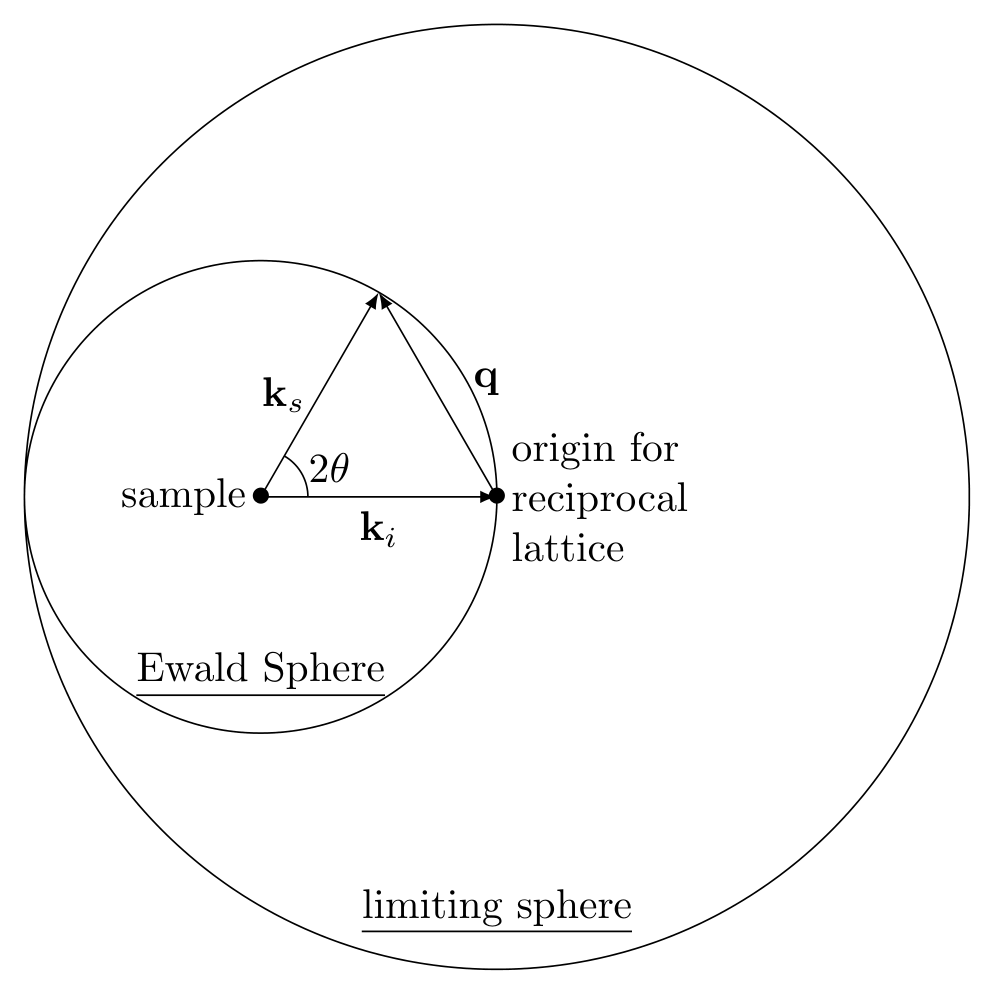
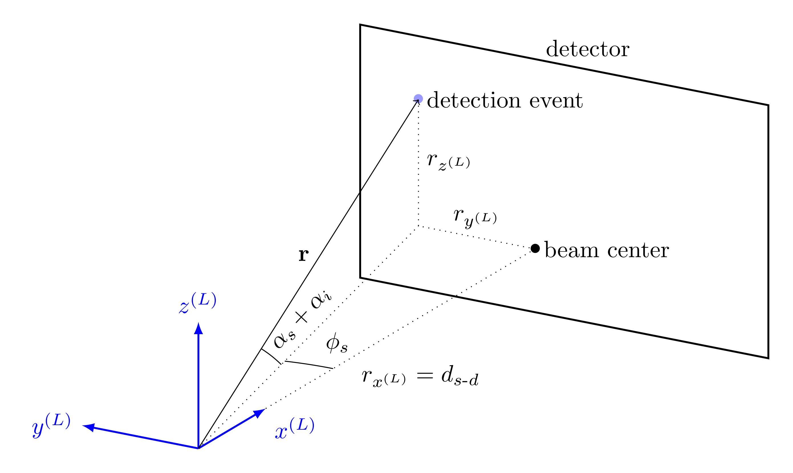
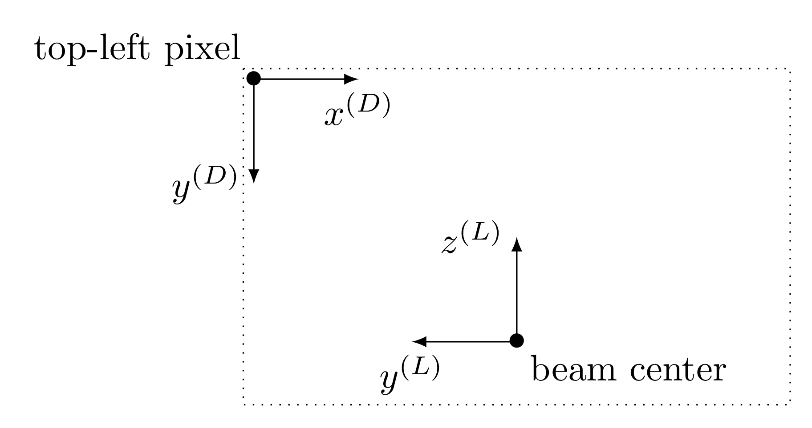

# Installation

GixPy is distributed on PyPI and can be installed using pip:

```
pip install gixpy
```

It can be built from source by cloning https://github.com/ttortorici/gixpy.git and using Python's `build` tool (don't forget to `cd` into the repository):

```
pip install -U setuptools build
python -m build --wheel
pip install dist/*.whl
```

where `*` should be replaced with the actual wheel's filename, and `\` should be used instead of `/` on Windows.


X-ray scattering experiments using an area detector require converting spacial coordinates to the



The *forbidden wedge* transformation is due to the fact that, in the sample frame (where the $c$-axis of the crystal is the $z$-axis of the frame), the $q$-vector has $x^{(S)}$, $y^{(S)}$, and $z^{(S)}$ components unless the incident angle $\alpha_i$ is equal to the scattered angle (toward the $z$-axis) $\alpha_s$. The geometry is shown in (a) of the above figure, which can be used to show that the incident and scattering wavevectors in the sample frame are

$$\begin{equation}
\begin{split}
    \mathbf{k}_i &= \frac{2\pi}{\lambda}
    \begin{bmatrix}
        \cos{\alpha_i}\\
        0\\
        -\sin{\alpha_i}
    \end{bmatrix}^{(S)},\\
    \mathbf{k}_s &= \frac{2\pi}{\lambda}
    \begin{bmatrix}
        \cos{\alpha_s}\cos{\phi_s}\\
        \cos{\alpha_s}\sin{\phi_s}\\
        \sin{\alpha_s}
    \end{bmatrix}^{(S)},
\end{split}
\end{equation}$$

where the $(S)$ superscript signifies the vector is in the basis of the sample frame. The $q$-vector is

$$\begin{equation}
    \mathbf{q} = \mathbf{k}_s - \mathbf{k}_i = \frac{2\pi}{\lambda}
    \begin{bmatrix}
        \cos{\alpha_s}\cos{\phi_s} - \cos{\alpha_i}\\
        \cos{\alpha_s}\sin{\phi_s}\\
        \sin{\alpha_s} + \sin{\alpha_i}
    \end{bmatrix}^{(S)}.
\end{equation}$$

Clearly, $q_y$ is zero when $\phi_s=0$, and therefore $q_x$ and $q_y$ are simultaneously zero when $\phi=0$ and $\cos\alpha_s=\cos\alpha_i$, so the only scattered wave with a $\mathbf{q}$ pointing only in the $z$-direction will be when $\phi_s = 0$ and $\alpha_s = \alpha_i$. Since this situation has equal incident and scattered angle, we can refer to it as the \emph{specular condition}.

A signal on the detector will be due to a scattered wave $\mathbf{k}_s$ hitting the detector, and this event will carry information about the corresponding $\mathbf{q}$. However, since the detector is perpendicular to the $\mathbf{k}_i$, it is easier to work in the lab frame (see (b) of the figure above) to determine which pixel on the detector $\mathbf{k}_f$ hits. The lab frame is rotated with $R_y(-\alpha_i)$ from the sample frame, so $\mathbf{k}_s$ in the lab frame is

$$\begin{equation}
    \mathbf{k}_s = R_y(-\alpha_i)\frac{2\pi}{\lambda}
    \begin{bmatrix}
        \cos{\alpha_s}\cos{\phi_s}\\
        \cos{\alpha_s}\sin{\phi_s}\\
        \sin{\alpha_s}
    \end{bmatrix}^{(S)} = \frac{2\pi}{\lambda}
    \begin{bmatrix}
        \cos{(\alpha_s+\alpha_i)}\cos{\phi_s}\\
        \cos{(\alpha_s+\alpha_i)}\sin{\phi_s}\\
        \sin{(\alpha_s+\alpha_i)}
    \end{bmatrix}^{(L)},
\end{equation}$$

where the $(L)$ superscript signifies the vector is in the lab frame basis. When the specular condition is met $(\alpha_i=\alpha_s)$, the scattered wavevector in the lab frame is

$$\begin{equation}
    \mathbf{k}_{s,\text{spec}} = \frac{4\pi}{\lambda}\sin{(2\alpha_i)}\hat{\mathbf{z}}^{(L)},
\end{equation}$$



The above figure shows how the angles $\alpha_i$, $\alpha_s$, and $\phi_s$ determine where a scattered wave will hit the detector. The location $\mathbf{r}$ will have the same direction as $\mathbf{k}_s$ (i.e. $\mathbf{\hat{k}}_s=\hat{\mathbf{r}}$); therefore

$$\begin{equation}
    \mathbf{r} = r
    \begin{bmatrix}
        \cos{(\alpha_s+\alpha_i)}\cos{\phi_s}\\
        \cos{(\alpha_s+\alpha_i)}\sin{\phi_s}\\
        \sin{(\alpha_s+\alpha_i)}
    \end{bmatrix}^{(L)} = 
    \begin{bmatrix}
        d_{s\text{-}d}\\
        r_{y^{(L)}}\\
        r_{z^{(L)}}
    \end{bmatrix}^{(L)},
\end{equation}$$

where

$$\begin{equation}
    r = \sqrt{d_{s\text{-}d}^2 + r_{y^{(L)}}^2 + r_{z^{(L)}}^2}.
\end{equation}$$



However, the detector's origin is the top-left pixel of the CCD array (see the figure above). This leads to one last transformation from the lab frame to the detector frame where

$$\begin{equation}
\begin{split}
    x^{(D)} &= b_x - r_{y^{(L)}},\\
    y^{(D)} &= b_y - r_{z^{(L)}}.
\end{split}
\end{equation}$$

So a detection event at a pixel ($x^{(D)}, y^{(D)}$) corresponds to scattering angles $\alpha_s$ and $\phi_s$ through the following relationship

$$\begin{equation}
\begin{split}
    x^{(D)} &= b_x - \cos{(\alpha_s+\alpha_i)}\sin{\phi_s}\sqrt{d_{s\text{-}d}^2 + (b_x - x^{(D)})^2 + (b_y - y^{(D)})^2}\\
    y^{(D)} &= b_y - \sin{(\alpha_s+\alpha_i)}\sqrt{d_{s\text{-}d}^2 + (b_x - x^{(D)})^2 + (b_y - y^{(D)})^2}\\
\end{split}
\end{equation}$$

$$\begin{equation}
\begin{split}
    \alpha_s &= \sin^{-1}\bigg(\frac{b_y-y^{(D)}}{\sqrt{d_{s\text{-}d}^2+(b_x-x^{(D)})^2+(b_y-y^{(D)})^2}}\bigg)-\alpha_i\\
    \phi_s &= \sin^{-1}\bigg(\frac{b_x-x^{(D)}}{\sqrt{d_{s\text{-}d}^2+(b_x-x^{(D)})^2}}\bigg)
\end{split}
\end{equation}$$

The $q$-vector can then be calculated with these angles using the equation relating $q$ to the scattering angles. 


The above plots show the amount of $q$ in each direction based on distance from the beam center on the detector. The lines are contour lines, with red signifying when the vector is 0 in this direction.

# The Algorithm

The algorithm calculates the $q_{xy}=\sqrt{q_x^2+q_y^2}$ and $q_z$ at every pixel based on the parameters given to the function. These are then used to calculate distances on the detector that would have corresponded to these $q$ values if the sample were a powder.
