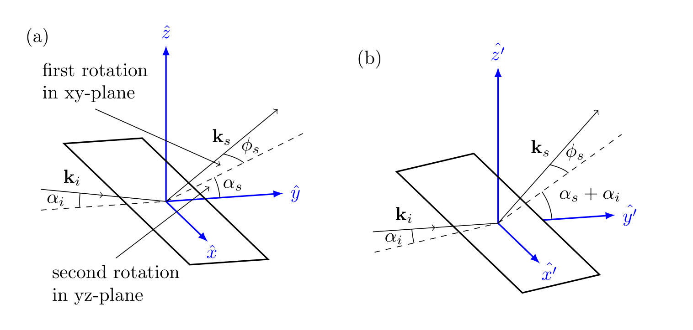

# Summary

Grazing incidence X-ray scattering techniques are utilized to investigate the crystal structure and orientation of crystallites in thin films. X-ray experiments that utilize area detectors to observe the resulting interference pattern, in general, require images to be transformed into data with respect to reciprocal space. However, for grazing incidence X-ray experiments, the experimental geometry leads to additional considerations to this transformation.

# Statement of need

There currently exists many tools for transforming wide-angle X-ray scattering (WAXS) and small-angle X-ray scattering (SAXS) images into reciprocal space, including pyFAI [@pyfai] and Nika [@nika]. However, these tools lack the capability of processing raw images taken for grazing incidence wide/small-angle X-ray scattering (GIWAXS/GISAXS). Here we refer to both GIWAXS and GISAXS as grazing incidence X-ray scattering (GIXS). There exists an existing tool, [pygix](https://github.com/tgdane/pygix), that is capable of processing GIWAXS and GISAXS images into reciprocal space, but this package, GixPy, differentiates itself from pygix through transparency and agnosticism.

GixPy seeks transparency in order to serve not only as a useful tool, but also an educational tool for those who are less familiar with the intricacies of grazing incidence experiments. This goal is achieved by maintaining well documented and commented code that utilizes direct computation (as opposed to relying on look-up tables), and is written with source-code readability in mind. This is intended to allow students to have an accessible resource, with examples, that helps them learn some of the intricacies of GIXS image processing for analysis.

GixPy's agnosticism allows it to be utilized as an intermediary step for anyone who already has a preferred WAXS/SAXS image processing software. This allows users to not need to learn an entirely new system to do their analysis in, and can simply use GixPy to pre-process an image before giving it to their preferred environment for analysis.

# Powder transformation


Existing tools, such as Nika and pyFAI transform images with the assumption that sample is a powder, such that the scattering results in Debye-Scherrer cones [@cullity3rd]. A typical experimental setup is exemplified in the the figure above. An area detector is used to intersect the Debye-Scherrer cones to detect rings of constructive interference.

The scattering angle $2\theta$ can be related to reciprocal space through Bragg's law:

\begin{equation}
    q = \frac{4\pi}{\lambda}\sin\theta,
\end{equation}

where $\lambda$ is the wavelength of the X-rays in the incident beam. The scattering angle can be determined from the radius of the ring on the detector $r$ and the sample-detector distance $d_{sd}$:

\begin{equation}
    \tan 2\theta = \frac{r}{d_{sd}},
\end{equation}

so a powder data transformation calculates $q$ using the ring radii using

\begin{equation}
    q = \frac{4\pi}{\lambda}\sin\bigg[\frac{1}{2}\tan^{-1}\bigg(\frac{r}{d_{sd}}\bigg)\bigg].
\end{equation}

GixPy transforms an image, such that a transformation assuming powder symmetry will produce correct results.

# Assumed Geometry

Currently, this package only supports geometries where the incident beam in perpendicular to the detector and the sample is brought into the beam path. This means that the point of normal incidence (PONI) on the detector and where the incident beam hits the detector (the beam center) are the same locations on the detector. Other geometries can be expanded if there is a demand to expand this package to be capable of calculations where the detector is rotated relative to the incident beam.


GixPy assumes the top-left pixel of the detector is the origin of the data array and defines the PONI being defined as the distance from the bottom-left corner of the detector (consistent with pyFAI), as seen in . Transforming between $\mathbf{r}_{\text{poni}_{i,j}}$ and $\mathbf{r}_\text{poni}$ can be done with the following relation:

\begin{align}
    \text{poni}_1 &= \bigg(R - i_\text{poni} - \frac{1}{2}\bigg)p_z\\
    \text{poni}_2 &= \bigg(j_\text{poni} + \frac{1}{2}\bigg)p_x,
\end{align}

where $R$ is the number of rows in the image and $p_x$ and $p_z$ are the horizontal and vertical widths of a pixel respectively. This transformation can be done with 

```python
gixpy.convert_to_poni(poni_ij, pixel_widths, image_shape)
```

and reversed with

```python
gixpy.convert_from_poni(poni, pixel_widths, image_shape)
```

# Scattering geometry

In grazing incidence X-ray scattering, the sample is tipped to an angle $\alpha_i$ with respect to the beam (with wavevector $\mathbf{k}_i$). A scattered wave (with wavevector $\mathbf{k}_s$) can be described by two angles: $\alpha_s$ and $\phi_s$, such that

\begin{equation}
\mathbf{k}_s = \frac{2\pi}{\lambda} R_x(\alpha_s)R_z(\phi_s)\ \hat{y},
\end{equation}



where $R_i(\theta)$ are rotation operators and $\hat{y}$ is the $y$-direction in the sample frame (as seen in ). In the lab frame, the sample is tipped by $\alpha_i$, so a $R_x(\alpha_i)$ rotation will move from the sample frame from the lab frame, so

\begin{equation}
\begin{split}
\mathbf{k}_s &= \frac{2\pi}{\lambda} R_x(\alpha_i)R_x(\alpha_s)R_z(\phi_s)\ \hat{y}'\\
&= \frac{2\pi}{\lambda} R_x(\alpha_s+\alpha_i)R_z(\phi_s)\ \hat{y}',
\end{split}
\end{equation}

where $\hat{y}'$ is the $y$-direction in the lab frame.


The scattering angles can then be related to coordinates on the detector as seen in:

\begin{align}
    z'' &= d_{sd} \tan(\alpha_s+\alpha_i)\\
    x'' &= \sqrt{d_{sd}^2+z^2}\tan(\phi_s),
\end{align}

where $z''$ and $x''$ are coordinates on the detector with respect to the $x''$-$z''$-plane. Note: the $z''$-direction is the same as the $z'$-direction, but has its origin at the PONI instead of the sample, but the $x''$-direction is reversed from the $x'$-direction.

Row $i$ and column $j$ coordinates can be related to $\mathbf{r}$ through the equations

\begin{align}
    x'' &= (j_\text{poni} - j)p_x\\
    z'' &= (i_\text{poni} - i)p_z,
\end{align}

where $i_\text{poni}$ and $j_\text{poni}$ are the row and column index of the PONI respectively, and $p_x$ and $p_z$ are the horizontal and vertical widths of a rectangular pixel.


# Reciprocal space

The scattering vector $\mathbf{q}$ is defined as

\begin{equation}
    \mathbf{q} = \mathbf{k}_s - \mathbf{k}_i,
\end{equation}

and the magnitude of the scattering vector can be related to the Bragg angle $\theta$ through Bragg's law: . The magnitude of the scattering vector is also related to a lattice plane spacing $d$ via

\begin{equation}
d = \frac{2\pi}{q}.
\end{equation}

In the sample frame (see a),

\begin{align}
    \mathbf{k}_i &= \frac{2\pi}{\lambda}
    \begin{bmatrix}
        0\\
        \cos{\alpha_i}\\
        -\sin{\alpha_i}
    \end{bmatrix},\\
    \mathbf{k}_s &= \frac{2\pi}{\lambda}
    \begin{bmatrix}
        -\sin{\phi_s}\\
        \cos{\alpha_s}\cos{\phi_s}\\
        \sin{\alpha_s}\cos{\phi_s}
    \end{bmatrix},
\end{align}

so in the sample frame, the scattering vector can be written

\begin{equation}
    \mathbf{q} = \mathbf{k}_s - \mathbf{k}_i = \frac{2\pi}{\lambda}
    \begin{bmatrix}
        -\sin{\phi_s}\\
        \cos{\alpha_s}\cos{\phi_s} - \cos{\alpha_i}\\
        \sin{\alpha_s}\cos{\phi_s} + \sin{\alpha_i}
    \end{bmatrix}.
\end{equation}

Many thin films have cylindrical symmetry, in that individual crystallites have a preferred orientation of a lattice vector in the $z'$-direction, but are disordered in rotations on the surface of the substrate [@film-texture-sim]. The cylindrical symmetry of the crystallites leads to cylindrical symmetry in reciprocal space, where $q_{xy}=\sqrt{q_x^2+q_y^2}$ represents the radial distance. A grazing incidence X-ray image transformation into reciprocal space then requires the following calculations:

\begin{align}
    q_{xy} &= \frac{2\pi}{\lambda}(\sin^2\phi_s+(\cos{\alpha_s}\cos{\phi_s} - \cos{\alpha_i})^2)\\
    q_z &= \frac{2\pi}{\lambda}(\sin{\alpha_s}\cos{\phi_s} + \sin{\alpha_i})
\end{align}

can be calculated using $\alpha_s$, $\alpha_i$, $\cos\phi_s$, and $\sin\phi_s$ as determined by the detector coordinates $x''$ and $z''$ and the sample-detector distance $d_{sd}$ (see ):

\begin{align}
    \alpha_s &= \tan^{-1}\bigg(\frac{z''}{d_{sd}}\bigg)-\alpha_i\\
    \cos\phi_s & = \sqrt{\frac{z''^2+d_{sd}^2}{x''^2+z''^2+d_{sd}^2}}\\
    \sin\phi_s & = \frac{x''}{\sqrt{x''^2+z''^2+d_{sd}^2}}
\end{align}

# Reverse transform

In order to suffice the agnosticism goal, after GixPy calculates $q_xy$ and $q_z$ for each pixel location, it then relates these to $r_{xy}$ and $r_{z}$ such that a powder transformation (utilizing ) will produce the correct results. This is done by reversing the powder transformation:

\begin{align}
    r = d_{sd}\tan\bigg[2\sin^{-1}\bigg(\frac{\lambda q}{4\pi}\bigg)\bigg],
\end{align}

where $q=\sqrt{q_{xy}^2+q_z^2}$. The following trig identities [@schaum]:

\begin{align}
\tan2u &= \frac{2\tan u}{1-\tan^2 u}\\
\tan \bigg[\sin^{-1}\bigg(\frac{u}{2}\bigg)\bigg] &= \frac{u}{\sqrt{4-u^2}},
\end{align}

can be used to show

\begin{align}
    r = d_{sd}q'\frac{\sqrt{4 - q'^2}}{2 - q'^2},
\end{align}

where $q'=\lambda q/4\pi$.

The azimuthal angle $\psi$ (as seen in ) is related to both $r$ and $q$ in the same way:

\begin{align}
    \cos\psi &= \frac{r_{xy}}{r} = \frac{q_{xy}}{q}\\
    \sin\psi &= \frac{r_z}{r} = \frac{q_z}{q},
\end{align}

so

\begin{align}
    r_{xy} &= rq'_{xy} \frac{\sqrt{4 - q'^2_{xy} - q'^2_z}}{2 - q'^2_{xy} - q'^2_z}\\
    r_z &= r q'_z\frac{\sqrt{4 - q'^2_{xy} - q'^2_z}}{2 - q'^2_{xy} - q'^2_z},
\end{align}

where $q'_{xy}=\lambda q_{xy}/4\pi$ and $q'_{z}=\lambda q_{z}/4\pi$. 

# Seeding the transformed image


For every pixel's location relative to the PONI, GixPy calculates an $r_{xy}$ and $r_z$ and then creates a new image where all the counts from each pixel is moved to a location corresponding to $r_{xy}$ and $r_z$ for that pixel. As illustrated in , the new image will have a PONI corresponding to the maximum value of $r_{xy}$ and $r_z$ of all the pixels:

\begin{align}
    i^T_\text{poni} &= \text{max}(r_z)\\
    j^T_\text{poni} &= \text{max}(r_{xy}),
\end{align}

so $r_{xy}$ and $r_z$, for each pixel, correspond to row $i^T$ and column $j^T$ in the transformed image according to

\begin{align}
    i^T &= \text{max}(r_z) - r_z\\
    j^T &= \text{max}(r_{xy}) - r_{xy}.
\end{align}

The transformed image will have rows $R^T$ and columns $C^T$ as determined by

\begin{align}
    R^T &= \text{ceil}(\text{max}(r_z) - \text{min}(r_z)) + 1\\
    C^T &= \text{ceil}(\text{max}(r_{xy})- \text{min}(r_{xy})) + 1,
\end{align}

where the minimums are negatively valued if the PONI is on the detector, $\text{ceil}(x)$ is the ceiling function, and the extra 1 is padding to guarantee that there is room for the pixel splitting step. The transformed image is seeded by creating a NumPy array of zeros with shape $(R^T,\ C^T)$. To account for how many pixels are moved to a new location, a second NumPy array, referred to as the transformed flat field

# Pixel splitting


A pixel index is determined by flooring $i^T$ and $j^T$, and the counts are split amongst that pixel's neighbors, as seen in . Remainders $\rho$ are determined by

\begin{align}
    \rho_i &= i^T - \text{floor}(i^T)\\
    \rho_j &= j^T - \text{floor}(j^T),
\end{align}

and the counts get distributed according to following weights

\begin{align}
    w_\text{current pixel} &= (1-\rho_i)(1-\rho_j)\\
    w_\text{column neighbor} &= (1-\rho_i)\rho_j\\
    w_\text{row neighbor} &= \rho_i(1-\rho_j)\\
    w_\text{diagonal neighbor} &= \rho_i\rho_j,
\end{align}

where the sum of the weights adds to 1. It is clear that when the remainders are zero, then the "current pixel" gets all the counts, and when both remainders are 0.5, all the pixels get 1/4 the counts.

# Moving pixels

Every pixel in the original image is looped over, and the new location $(i^T,\ j^T)$ is determined by . The weights are calculated for distributing the counts across the neighbors as described in the above section, and the counts at those locations are increased by the number of counts in the original pixel weighted appropriately. 


