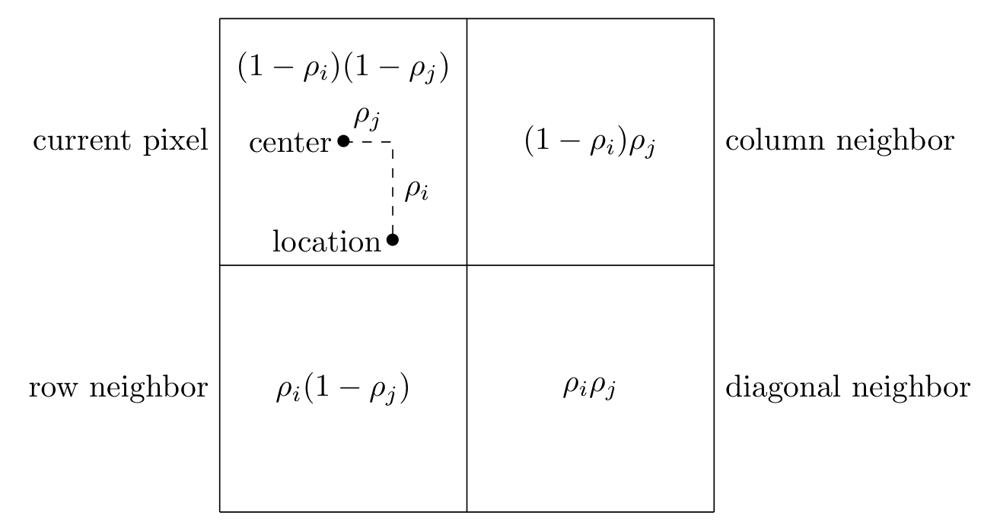

# Summary

Grazing incidence X-ray scattering techniques are used to investigate the atomic structure of materials localized on a flat surface. Such materials often grow with a preferred crystal orientation, such as uniaxially aligned thin films [@how-to-giwaxs]. Often area detectors are used to image angular scattering. These images are then transformed such that the axes represent Fourier components of the spatial scattering, i.e. "reciprocal space". X-ray image analysis software often assumes that the sample is a randomaly oriented powder. However, for grazing incidence X-ray experiments, crystallites in the film often have a preferred orientation, and the image manipulation requires additional considerations.

X-ray scattering experiments frequently use a parallel beam of X-rays with incident wavevector $\mathbf{k}_i$, with magnitude $2\pi/\lambda$, where $\lambda$ is the X-ray wavelength. The beam is directed at a sample (an example is shown in Figure \ref{fig:waxs}). X-rays scattered from electrons in the sample have a new wavevector $\mathbf{k}_s$. Here, we consider the case of elastic scattering where the magnitude of $\mathbf{k}_s$ is $2\pi/\lambda$. Scattered X-rays are collected on a planar imaging array of X-ray detecting pixels [@medical-imaging]. The measured values at a pixel location determine $\mathbf{k}_s$, and along with the known $\mathbf{k}_i$, the so-called reciprocal space can be built from the scattering vector $\mathbf{q}$:

\begin{equation}
\label{eq:q}
    \mathbf{q} \equiv \mathbf{k}_s - \mathbf{k}_i.
\end{equation}

X-ray scattering theory shows that the scattering vectors are the Fourier components of the spatial electron density in the sample and are the principal information yielded by X-ray scattering experiments.

# Statement of need

There currently exist many tools for transforming wide-angle X-ray scattering (WAXS) and small-angle X-ray scattering (SAXS) images into reciprocal space, including pyFAI [@pyfai] and Nika [@nika]. However, these tools lack the capability of processing raw images from grazing incidence wide/small-angle X-ray scattering (GIWAXS/GISAXS) experiments. Here we refer to both GIWAXS and GISAXS as grazing incidence X-ray scattering (GIXS). An existing Python package, [pygix](https://github.com/tgdane/pygix), is capable of processing GIWAXS and GISAXS images into reciprocal space. However, it lacks transparency, in that, the documentation is sparse, and it utilizes look-up tables to perform the transformation, making the source code difficult to parse. Furthermore, researchers interested in utilizing GIXS experiments likely already do powder X-ray experiments, and have a preferred suite of analysis tools, and pygix lacks the ability to be an intermediary step for non-Python tools.

GixPy seeks transparency in order to serve not only as a useful tool, but also an educational tool for those who are less experienced with grazing incidence experiments. This goal is achieved by maintaining well documented and commented code that utilizes direct computation, and is written with source-code readability in mind. This is intended to allow students and researchers to have an accessible resource, with examples, that helps them learn how to process GIXS images and understand the necessity of this procedure.

Furthermore, GixPy is designed to be compatible with any existing software used to process X-ray images for powder samples. This makes GixPy is workflow agnostic and allows it to be utilized as an intermediary step for anyone who already has a preferred WAXS/SAXS image processing software. This allows users to not need to learn an entirely new system, and can simply use GixPy to pre-process an image before giving it to their preferred environment for analysis. However, since GixPy is built as a Python tool, it has been built to seamlessly integrate with pyFAI to serve as a complete processing tool as well.

# Powder transformation

Existing tools, such as Nika and pyFAI transform images with the assumption that samples are a powder, such that the X-ray scattering results in angularly symmetric Debye-Scherrer cones [@cullity3rd]. A typical experimental setup is exemplified in Figure \ref{fig:waxs}. An area detector is used to intersect the Debye-Scherrer cones to detect rings of constructive interference.

The scattering angle for a Debye-Scherrer cone ($2\theta$ in Figure \ref{fig:waxs}) can be related to the characteristic Fourier components of spatial electron density with any particular Fourier component $q$ related to a specific Debye-Scherrer cone angle by Bragg's law:

\begin{equation}
\label{eq:bragg}
    q = \frac{4\pi}{\lambda}\sin\theta,
\end{equation}

where $\lambda$ is the wavelength of the scattered X-rays. The scattering angle can be determined from the radius of the ring on the detector $r$ and the sample-detector distance $d_{sd}$:

\begin{equation}
    \tan 2\theta = \frac{r}{d_{sd}},
\end{equation}

so a powder image transformation calculates $q$ from the ring radii using

\begin{equation}
\label{eq:powder}
    q = \frac{4\pi}{\lambda}\sin\bigg[\frac{1}{2}\tan^{-1}\bigg(\frac{r}{d_{sd}}\bigg)\bigg].
\end{equation}


A GixPy transformation processes an image, such that a processed image can be transformed assuming powder symmetry will produce correct results.

# Geometric assumptions

GixPy supports geometries where the incident beam is perpendicular to the detector and the sample is brought into the beam path (see Figure \ref{fig:experimental-geometry}). Not only does this geometry lead to simplifications that allow for more transparent calculations, but it is also consistent with many laboratory-scale GIXS systems, such as the Xenox Xuess.  In this geometry, the point of normal incidence (PONI) on the detector and where the incident beam hits the detector (the beam center) are the same locations on the detector.

The top-left pixel of the detector is the origin of the data array and the PONI is defined as the distance from the bottom-left corner of the detector (consistent with pyFAI), as seen in Figure \ref{fig:pixel-poni}. Other software, including Nika, define the PONI by the row-column index $(i_\text{poni},\ j_\text{poni})$. Transforming between these two conventions can be done with the following relation:

\begin{align}
    \text{poni}_1 &= \bigg(R - i_\text{poni} - \frac{1}{2}\bigg)p_z\\
    \text{poni}_2 &= \bigg(j_\text{poni} + \frac{1}{2}\bigg)p_x,
\end{align}

where $R$ is the number of rows in the image and $p_x$ and $p_z$ are the horizontal and vertical widths of a pixel respectively. This transformation can be done with 

```Python
gixpy.poni.convert_to(poni_ij, pixel_widths, image_shape)
```

and reversed with

```Python
gixpy.poni.convert_from(poni, pixel_widths, image_shape)
```

Where each input can be a tuple, list, or NumPy array, with the first element being the vertical value and the second element being the horizontal value.


# Scattering geometry

In grazing incidence X-ray scattering, there is a very small angle, called the grazing angle or incident angle, between the incident beam and the plane of the substrate the sample lies on. The incident beam, with wavelength $\lambda$, has a wavevector $\mathbf{k}_i$ with magnitude $2\pi/\lambda$. Elastic scattering, due to bound electrons in the film, will result in a scattered ray with wavevector $\mathbf{k}_s$ with the same magnitude. In the sample frame (Figure \ref{fig:scattering-angles}a), the axes are oriented along orthogonal basis vectors $\hat{x}$, $\hat{y}$, and $\hat{z}$. $\hat{z}$ is surface-normal to the substrate, $\hat{y}$ is orthogonal to $\hat{z}$ and in a direction such that $\mathbf{k}_i$ lies in the $\hat{y}$-$\hat{z}$ plane, and $\hat{x}$ is orthogonal to $\hat{y}$ and $\hat{z}$. In the sample frame, the direction of the scattered ray can be described by rotations from the $\hat{y}$-direction:

\begin{equation}
\label{eq:ks-def}
    \mathbf{k}_s = \frac{2\pi}{\lambda} \overleftrightarrow{R}_{\hat{x}}(\alpha_s)\overleftrightarrow{R}_{\hat{z}}(\phi_s)\ \hat{y} = \frac{2\pi}{\lambda} \overleftrightarrow{R}_{\hat{x}}(\alpha_s)\overleftrightarrow{R}_{\hat{z}}(\phi_s)
    \begin{bmatrix}
        0\\
        1\\
        0
    \end{bmatrix}
    = \frac{2\pi}{\lambda}
    \begin{bmatrix}
        -\sin\phi_s\\
        \cos\alpha_s\cos\phi_s\\
        \sin\alpha_s\cos\phi_s
    \end{bmatrix},
\end{equation}

where $\overleftrightarrow{R}_{\hat{x}}(\theta)$ and $\overleftrightarrow{R}_{\hat{z}}(\theta)$ are rotation matrix operators:

\begin{align}
    \overleftrightarrow{R}_{\hat{x}}(\theta) &= 
    \begin{bmatrix}
        1 & 0 & 0 \\
        0 & \cos\theta & -\sin\theta\\
        0 & \sin\theta & \cos\theta
    \end{bmatrix} \\
    \overleftrightarrow{R}_{\hat{y}}(\theta) &= 
    \begin{bmatrix}
        \cos\theta & 0 & \sin\theta \\
        0 & 1 & 0\\
        -\sin\theta & 0 & \cos\theta
    \end{bmatrix} \\
    \overleftrightarrow{R}_{\hat{z}}(\theta) &= 
    \begin{bmatrix}
        \cos\theta & -\sin\theta & 0 \\
        \sin\theta & \cos\theta & 0 \\
        0 & 0 & 1
    \end{bmatrix},
\end{align}

and the column vectors are in the $(\hat{x},\ \hat{y},\ \hat{z})$ basis. Typically rotations are applied in the opposite order [@how-to-giwaxs], but here, we choose this order of operations because it leads to simplifications in the calculations detailed in this paper.


In the lab frame (see Figure \ref{fig:scattering-angles}b), the axes are denoted by the basis vectors $\hat{x}'$, $\hat{y}'$, and $\hat{z}'$, and column vectors in this basis are denoted with a prime ($'$). The lab frame basis vectors are determined by rotating the sample frame basis vectors with $\overleftrightarrow{R}_{\hat{x}'}(\alpha_i)$. Therefore, a vector can be transformed from the sample frame basis to the lab frame basis with this rotation operator.

For example, the $\mathbf{k}_i$ in the sample frame is

\begin{equation}
\label{eq:ki-def}
    \mathbf{k}_i = \frac{2\pi}{\lambda}
    \begin{bmatrix}
        0 \\
        \cos\alpha_i \\
        -\sin\alpha_i
    \end{bmatrix},
\end{equation}

and can be written in the lab frame as

\begin{equation}
    \mathbf{k}_i = \frac{2\pi}{\lambda} \overleftrightarrow{R}_{\hat{x}'}(\alpha_i)
    \begin{bmatrix}
        0 \\
        \cos\alpha_i \\
        -\sin\alpha_i
    \end{bmatrix}' = \frac{2\pi}{\lambda}
    \begin{bmatrix}
        0 \\
        1 \\
        0
    \end{bmatrix}'.  \\
\end{equation}

Therefore, in the lab frame, $\mathbf{k}_s$ is

\begin{equation}
\begin{split}
    \mathbf{k}_s &= \frac{2\pi}{\lambda} \overleftrightarrow{R}_{\hat{x}'}(\alpha_i)
    \begin{bmatrix}
        -\sin\phi_s\\
        \cos\alpha_s\cos\phi_s\\
        \sin\alpha_s\cos\phi_s
    \end{bmatrix}' \\
    &= \frac{2\pi}{\lambda} \overleftrightarrow{R}_{\hat{x}'}(\alpha_i)\overleftrightarrow{R}_{\hat{x}'}(\alpha_s)\overleftrightarrow{R}_{\hat{z}'}(\phi_s)\ \hat{y}'\\
    &= \frac{2\pi}{\lambda} \overleftrightarrow{R}_{\hat{x}'}(\alpha_s+\alpha_i)\overleftrightarrow{R}_{\hat{z}'}(\phi_s)\ \hat{y}'\\
    &= \frac{2\pi}{\lambda}
    \begin{bmatrix}
        -\sin\phi_s\\
        \cos(\alpha_s+\alpha_i)\cos\phi_s\\
        \sin(\alpha_s+\alpha_i)\cos\phi_s
    \end{bmatrix}'.
\end{split}
\end{equation}

A third reference frame, the PONI frame, is a two dimensional space in the plane of the detector with basis vectors $\hat{x}''$ and $\hat{z}''$ and with an origin at the PONI. The $\hat{z}''$-direction is the same as the $\hat{z}'$-direction, but the $\hat{x}''$-direction is in the opposite direction of $\hat{x}'$, so that positive $\phi_s$ correspond to positive $x''$. A pixel location can be expressed as $\mathbf{r}''$, where

\begin{equation}
    \mathbf{r}'' = x''\ \hat{x}'' + z''\ \hat{z}''.
\end{equation}

The scattering angles, $\phi_s$ and $\alpha_s$ can then be related to $\mathbf{r}''$ as seen in Figure \ref{fig:scattering-detector}:

\begin{align}
    z'' &= d_{sd} \tan(\alpha_s+\alpha_i)\\
    x'' &= \sqrt{d_{sd}^2+{z''}^2}\tan(\phi_s),
\end{align}

where $d_{sd}$ is the sample detector distance.

Row $i$ and column $j$ coordinates can be related to $\mathbf{r}$ through the equations

\begin{align}
    x'' &= (j_\text{poni} - j)p_x\\
    z'' &= (i_\text{poni} - i)p_z,
\end{align}

where $i_\text{poni}$ and $j_\text{poni}$ are the row and column index of the PONI respectively, and $p_x$ and $p_z$ are the horizontal and vertical widths of a rectangular pixel.


# Reciprocal space

The scattering vector, defined in Equation (\ref{eq:q}), is directly related to the Fourier components of the electron density of the material under study. This Fourier space is referred to as reciprocal space, and the magnitude of the scattering vector can be related to the Bragg angle $\theta$ through Bragg's law: Equation (\ref{eq:bragg}). For crystalline materials, the magnitude of the scattering vector is also related to a lattice plane spacing $d$ via

\begin{equation}
    d = \frac{2\pi}{q}.
\end{equation}

In the sample frame (Figure \ref{fig:scattering-angles}a), the scattering vector can be written using Equations (\ref{eq:ks-def}) and (\ref{eq:ki-def}):

\begin{equation}
    \mathbf{q} = \mathbf{k}_s - \mathbf{k}_i = \frac{2\pi}{\lambda}
    \begin{bmatrix}
        -\sin{\phi_s}\\
        \cos{\alpha_s}\cos{\phi_s} - \cos{\alpha_i}\\
        \sin{\alpha_s}\cos{\phi_s} + \sin{\alpha_i}
    \end{bmatrix}.
\end{equation}

Many thin films have cylindrical symmetry, in that individual crystallites have a preferred orientation of a lattice vector in the $z$-direction (normal to the substrate surface), but are disordered in rotations on the surface of the substrate [@film-texture-sim]. The cylindrical symmetry of crystallite orientations leads to cylindrical symmetry in reciprocal space, where $q_{xy}=\sqrt{q_x^2+q_y^2}$ represents the radial axis. A grazing incidence X-ray image transformation into reciprocal space then requires the following calculations:

\begin{align}
\label{eq:qxy}
    q_{xy} &= \frac{2\pi}{\lambda}\sqrt{\sin^2\phi_s+(\cos{\alpha_s}\cos{\phi_s} - \cos{\alpha_i})^2}\\
\label{eq:qz}
    q_z &= \frac{2\pi}{\lambda}(\sin{\alpha_s}\cos{\phi_s} + \sin{\alpha_i}).
\end{align}

Equations (\ref{eq:qxy}) and (\ref{eq:qz}) can be calculated using $\alpha_s$, $\alpha_i$, $\cos\phi_s$, and $\sin\phi_s$ as determined by the detector coordinates $x''$ and $z''$ and the sample-detector distance $d_{sd}$ (Figure \ref{fig:scattering-detector}):

\begin{align}
\label{eq:alpha_s}
    \alpha_s &= \tan^{-1}\bigg(\frac{z''}{d_{sd}}\bigg)-\alpha_i\\
\label{eq:cos_phi}
    \cos\phi_s & = \sqrt{\frac{z''^2+d_{sd}^2}{x''^2+z''^2+d_{sd}^2}}\\
\label{eq:sin_phi}
    \sin\phi_s & = \frac{x''}{\sqrt{x''^2+z''^2+d_{sd}^2}}.
\end{align}

# Reverse transform

In order for GixPy to be compatible with existing X-ray image analysis software (accomplishing the agnosticism goal), after $q_{xy}$ and $q_z$ are calculated for each pixel location, they are related to $r_{xy}$ and $r_{z}$ such that a powder transformation (utilizing Equation (\ref{eq:powder})) will produce the correct results. This is done by reversing the powder transformation:

\begin{align}
    r = d_{sd}\tan\bigg[2\sin^{-1}\bigg(\frac{\lambda q}{4\pi}\bigg)\bigg],
\end{align}

where $q=\sqrt{q_{xy}^2+q_z^2}$. The following trig identities [@schaum]:

\begin{align}
    \tan2u &= \frac{2\tan u}{1-\tan^2 u}\\
    \tan \bigg[\sin^{-1}\bigg(\frac{u}{2}\bigg)\bigg] &= \frac{u}{\sqrt{4-u^2}},
\end{align}

can be used to show

\begin{align}
    r = d_{sd}q'\frac{\sqrt{4 - q'^2}}{2 - q'^2},
\end{align}

where $q'=\lambda q/4\pi$.

The azimuthal angle $\psi$ (as seen in Figures \ref{fig:scattering-detector} and \ref{fig:detector-origin}) is related to both $r$ and $q$ in the same way:

\begin{align}
    \cos\psi &= \frac{r_{xy}}{r} = \frac{q_{xy}}{q}\\
    \sin\psi &= \frac{r_z}{r} = \frac{q_z}{q},
\end{align}

so

\begin{align}
\label{eq:rxy}
    r_{xy} &= d_{sd}q'_{xy} \frac{\sqrt{4 - q'^2_{xy} - q'^2_z}}{2 - q'^2_{xy} - q'^2_z}\\
\label{eq:rz}
    r_z &= d_{sd} q'_z\frac{\sqrt{4 - q'^2_{xy} - q'^2_z}}{2 - q'^2_{xy} - q'^2_z},
\end{align}

where $q'_{xy}=\lambda q_{xy}/4\pi$ and $q'_{z}=\lambda q_{z}/4\pi$.

# Seeding the transformed image

For every pixel's location relative to the PONI, GixPy calculates an $r_{xy}$ and $r_z$ using Equations (\ref{eq:rxy}) and (\ref{eq:rz}) and then creates a new image where all the counts from each pixel are moved to a location corresponding to $r_{xy}$ and $r_z$ for that pixel. As illustrated in Figure \ref{fig:detector-transform}, the new image will have a PONI corresponding to the maximum value of $r_{xy}$ and $r_z$ of all the pixels:

\begin{align}
\label{eq:poni-iT}
    i^T_\text{poni} &= \text{max}(r_z) / p_z\\
\label{eq:poni-jT}
    j^T_\text{poni} &= \text{max}(r_{xy}) / p_x,
\end{align}

where $p_z$ and $p_x$ are the vertical and horizontal widths of a pixel respectively. $r_{xy}$ and $r_z$, for each pixel, correspond to row $i^T$ and column $j^T$ in the transformed image according to

\begin{align}
\label{eq:iT}
    i^T &= \text{max}(r_z) - r_z\\
\label{eq:jT}
    j^T &= \text{max}(r_{xy}) - r_{xy}.
\end{align}


The transformed image will have rows $R^T$ and columns $C^T$ as determined by

\begin{align}
\label{eq:rowsT}
    R^T &= \text{ceil}(\text{max}(r_z) - \text{min}(r_z)) + 1\\
\label{eq:colsT}
    C^T &= \text{ceil}(\text{max}(r_{xy})- \text{min}(r_{xy})) + 1,
\end{align}

where the minimums are negatively valued if the PONI is on the detector, $\text{ceil}(x)$ is the ceiling function, and the extra 1 is padding to guarantee that there is room for the pixel splitting step. The transformed image is seeded by creating a NumPy array of zeros with shape $(R^T,\ C^T)$. To account for how many pixels are moved to a new pixel location, a second NumPy array, referred to as the transformed flat field is also created.

# Pixel splitting

A pixel index is determined by flooring $i^T$ and $j^T$, and the counts are split amongst that pixel's neighbors, as seen in Figure \ref{fig:pixel-split}. Remainders $\rho$ are determined by

\begin{align}
    \rho_i &= i^T - \text{floor}(i^T)\\
    \rho_j &= j^T - \text{floor}(j^T),
\end{align}

and the counts get distributed according to following weights

\begin{align}
\label{eq:w1}
    w_\text{current pixel} &= (1-\rho_i)(1-\rho_j)\\
\label{eq:w2}
    w_\text{column neighbor} &= (1-\rho_i)\rho_j\\
\label{eq:w3}
    w_\text{row neighbor} &= \rho_i(1-\rho_j)\\
\label{eq:w4}
    w_\text{diagonal neighbor} &= \rho_i\rho_j,
\end{align}

where the sum of the weights adds to 1. It is clear that when the remainders are zero, then the "current pixel" gets all the counts, and when both remainders are 0.5, all the pixels get 1/4 the counts.



# Moving pixels

Every pixel in the original image is looped over, and the new row and column indices $(i^T,\ j^T)$ are determined using Equations (\ref{eq:iT}) and (\ref{eq:jT}) by first calculating scattering angles using Equations (\ref{eq:alpha_s}) to (\ref{eq:sin_phi}). Then $q_{xy}$ and $q_z$ are computed with Equations (\ref{eq:qxy}) and (\ref{eq:qz}), $r_{xy}$ and $r_z$ with Equations (\ref{eq:rxy}) and (\ref{eq:rz}), and the new PONI and image shape with Equations (\ref{eq:poni-iT}), (\ref{eq:poni-jT}), (\ref{eq:rowsT}), and (\ref{eq:colsT}). The weights are calculated for each pixel using Equations (\ref{eq:w1}) to (\ref{eq:w4}), and the counts in pixel $(i,\ j)$ from the original image are added to the counts in pixel $(i^T,\ j^T)$ and its neighbors according to the pixel splitting weights. This is executed by compiled C code written in gixpy.c, but a Pythonic version of this step would look like:

```Python
new_image = np.zeros((R_T, C_T))  # as determined by Eq (34) and (35)
new_flatfield = np.zeros((R_T, C_T))
for i in range(image.shape[0]):      # loop over rows of the original image
    for j in range(image.shape[1]):  # loop over columns of the original image
        new_i = int(i_T[i, j])       # floor of i^T, as calculated by Eq (32)
        new_j = int(j_T[i, j])       # floor of j^T, as calculated by Eq (33)
        
        # calculate weights
        remainder_i = i_T[i, j] - new_i  # Eq (36)
        remainder_j = j_T[i, j] - new_j  # Eq (37)
        w_current_pixel = (1 - remainder_i) * (1 - remainder_j)  # Eq (38)
        w_column_neighbor = (1 - remainder_i) * remainder_j      # Eq (39)
        w_row_neighbor = remainder_i * (1 - remainder_j)         # Eq (40)
        w_diagonal_neighbor = remainder_i * remainder_j          # Eq (41)

        # split pixel
        new_image[new_i, new_j] += image[i, j] * w_current_pixel
        new_image[new_i + 1, new_j] += image[i, j] * w_row_neighbor
        new_image[new_i, new_j + 1] += image[i, j] * w_column_neighbor
        new_image[new_i + 1, new_j + 1] += image[i, j] * w_diagonal_neighbor

        # account for pixel movement
        new_flatfield[new_i, new_j] += w_current_pixel
        new_flatfield[new_i + 1, new_j] += w_row_neighbor
        new_flatfield[new_i, new_j + 1] += w_column_neighbor
        new_flatfield[new_i + 1, new_j + 1] += w_diagonal_neighbor
```

# Tilt correction

In general, the sample could be rotated about the $\hat{y}'$-direction (direction of the beam) relative to $\hat{z}''$ (the veritcal direction of the detector). This creates an angle $\eta$ between $\hat{z}''$ (detector frame) and $\hat{z}'$ (lab frame) rotated in the $\hat{y}'$-direction (see Figure \ref{fig:tilt}). This so-called *tilt angle* will often be non-zero even if the stage is machined precisely and the detector is well aligned because the sample often will not have parallel surfaces, so its top surface is not garanteed to be parallel to the bottom surface.

The tilt correction rotates the $\mathbf{r}''$ vectors representing the location of each pixel relative to the PONI to rotate $\hat{z}''$ so that they form an angle $\eta$ with $\hat{z}'$. The distances $x''$ and $z''$ are first determined by row, column index and pixel size, and then rotated with $\overleftrightarrow{R}_{\hat{y}}(\eta)$.


# Flat-field correction

A flat-field correction is used to compensate for relative gains of each pixel [@medical-imaging]. A corrected image $C$ is computed from the raw data $R$ and a flat-field image $F$, where the flat-field values represent the relative sensitivity of each pixel:

\begin{equation}
    C = \frac{R}{F}.
\end{equation}

A flat field image is used to correct for pixels that are more or less sensitive than the average pixel, and/or if mulitple images are stitched together such that there are regions of the stitch that have more or less exposure time than average. Regardless of whether or not a flat-field correction is needed for the original image, a flat-field correction will always be needed for the GIXS transformation.

As can be seen in Figure \ref{fig:flat-waxs}, the transformation results in a *missing wedge* [@quantify-film-alignment]. Pixels moved out of the missing wedge disportionately move to the edge of the wedge. This results in these pixels, in the transformation, being more sensitive than pixels not near the edge of the wedge.


The extra brightness along this edge is corrected by also transforming the original image's flat field. An array of ones will represent the flat-field image for an image that needs no correction. The result of a GIXS transform will then yield both an array for the data image and for the flat-field image, where the transformed flat-field image can be used to correct for the edge brightness.

# Solid-angle correction

X-rays generated by X-ray tube sources lose intensity according to the inverse square law. Since a flat area detector is used to detect the scattered rays, rays that are detected further from the PONI will lose more intensity than those detected near the PONI. A solid-angle correction adjusts the intensity of pixels to the amount of counts the detector would see if its surface wrapped a sphere around the sample. This is often desired to compare to data that would be collected by a diffractometer.

The distance a ray travels $d_\text{ray}$ to the detector is determined by the sample-detector distance $d_{sd}$ and the scattering angle $2\theta$ (as seen in Figure \ref{fig:waxs}).

\begin{equation}
    d_{sd} = d_\text{ray} \cos{2\theta}.
\end{equation}

The intensity of a ray that travels a distance $d_\text{ray}$ relative to its intensity after traveling a distance $d_{sd}$ is then

\begin{equation}
    \frac{I({d_\text{ray}})}{I({d_{sd}})} = \bigg(\frac{d_{sd}}{d_\text{ray}}\bigg)^2 =  \cos^2{2\theta}.
\end{equation}

Furthermore, the incident X-ray beam sees the pixel area subtended as smaller by an additional factor of $\cos2\theta$ due to the ray not hitting the pixel sufrace-normal. The angle of incidence the ray makes with the detector will be the same as the scattering angle. To correct the number of X-ray counts to a value that would be seen by a pixel surface-normal to the X-ray beam therefore requires an additional factor of $\cos2\theta$. Therefore, rays that hit the detector will lose intensity---compared to a hypothetical spherical array of pixels with the sample at the center of the sphere---according to $\cos^3{2\theta}$. A solid angle correction reverses this attentuation by multiplying the counts in pixels by $\Omega$, where

\begin{equation}
\label{eq:solid-angle}
    \Omega = \sec^3{2\theta}.
\end{equation}

Since the solid-angle correction is relative to the geometry of the original image, it is best to apply the solid-angle correction during the transformation, and it should *NOT* be applied to the transformed image.


# Acknowledgements

The authors gratefully acknowledge use of the Materials Research X-Ray Diffraction Facility at the University of Colorado Boulder (RRID: SCR_019304), with instrumentation supported by NSF MRSEC Grant DMR-1420736.

# Refrences
